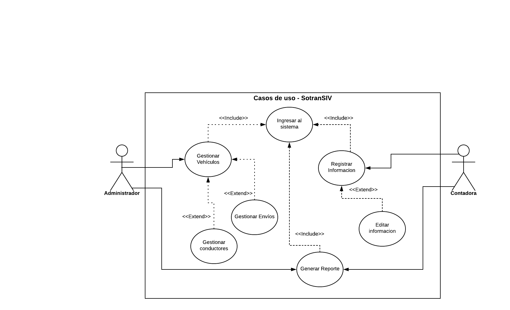

# proyect_cesw
Proyecto de asignatura de Construcción de Elementos de Software Web.  

## Título del proyecto:
SotranSIV (Sistema de Información de vehículos)

## Descripción del problema:
En la empresa Sotranscol se evidencia la necesidad de tener un sistema que arroje el histórico de cada vehículo con los consumos que se han realizados y ganancias obtenidas, ya que dicha información se maneja de manera física, siendo poco eficiente generando gran dificultad a la hora de buscar dicha información.

## Justificación
Este sistema servirá para agilizar los procesos de búsqueda de los consumos de cada vehículo y ganancias de la empresa. Siendo conveniente porque se optimiza el tiempo y se evita la  acomulación de papel, que con el tiempo se va perdiendo y deteriorando.

## Descripción de la propuesta:
Se desarrollará un aplicativo web llamado SotranSIV,  que permita al usuario registrar, modificar, consultar y eliminar los datos de los vehículos de carga de la empresa y de acuerdo a la información almacenada se generan informes en cuanto a los consumos del vehículo y las ganancias de la empresa, además se mostrará un log de auditoría  donde almacena el registro de quien guarda, modifica o elimina con su respectiva fecha.

Después de un análisis se llegó a la conclusión que el aplicativo tendrá los siguientes módulos:

   ### Módulo de informes: 
   Se podrá consultar la información de los consumos de los vehículos y ganancias de la  empresa.

   ### Módulo de vehículo: 
   Se guarda, modifica y elimina la información de los vehículos.

   ### Módulo de conductores: 
   Se guarda, modifica y elimina la información de los conductores de la empresa.
 
   ### Módulo de alertas: 
   Se genera una alerta cuando algún documento del conductor o vehículo esté próximo a renovar.

   ### Módulo de envíos: 
   Se tendrá en cuenta un módulo en donde se indiquen los viajes que ha tenido el conductor con ese mismo vehículo: 
   Ejemplo: Volqueta - Medellin - Bogota : Cargamento de baldosa. 

  ## Fuera del alcance: 
  No se tomará en cuenta el proceso de liquidación de la empresa. 
  
## Objetivo general
Desarrollar un sistema de información para almacenar el histórico de consumos de los vehículos y las ganancias de la empresa.

## Objetivos específicos
  *Determinar los datos requeridos por el cliente para la elaboración de los diagramas lógicos (UML), mediante un previo análisis del funcionamiento de la empresa 
  
  *Establecer el prototipo de las ventanas del sistema para ver de manera fiel cómo va a quedar la aplicación y si es necesario optimizar el diseño, apariencia y usabilidad de la misma, utilizando Herramientas que faciliten la construcción de las mismas. 

  *Definir las consultas necesarias para generar los informes que el cliente necesita, de una manera óptima mejorando el tiempo de búsqueda de la información, por medio de Querys bien estructurados.
  
  *Demostrar la calidad del desarrollo por medio de pruebas automatizadas, las cuales ayudarán a simular la interacción del usuario con el sistema, por medio del patrón de diseño Screenplay.

## Caso de uso

