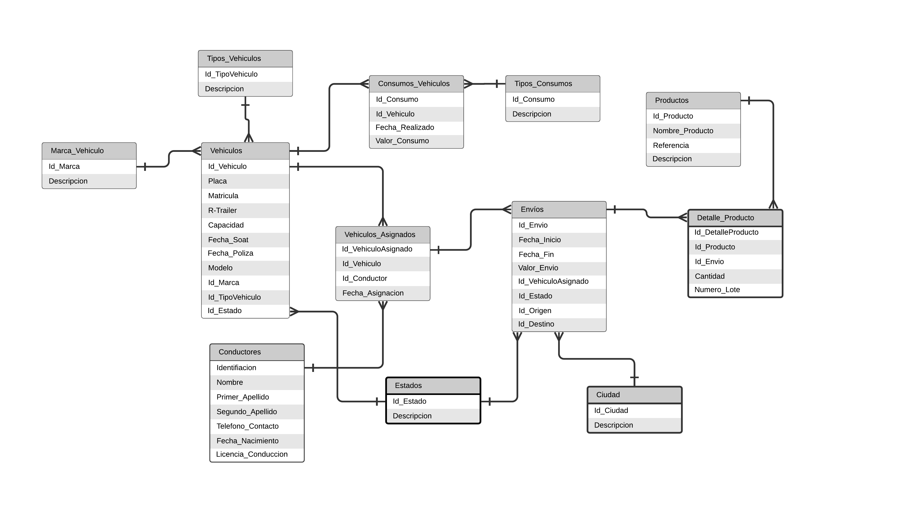

# proyect_cesw
Proyecto de asignatura de Construcción de Elementos de Software Web.  

## Informe Tres

Introducción

Esta documentación lo ayudará a familiarizarse con los recursos de los EndPoints de la API y del Front de la Aplicacion SotranSIV,  la cual mostrará cómo hacer diferentes consultas, para que pueda aprovecharla al máximo.

## EndPoint FrontEnd
El deploy del FrontEnd se realizo en netlify 

URL: https://sotransiv.netlify.app/

## EndPoint API

### Esta API fue desarrollada  haciendo uso de NodeJs y Express.js y MySql.
### y se realizo el deploy del backend en Heroku 

### Módulo Vehículos

Consigue todos los Vehiculos
Puede acceder a la lista de caracteres utilizando el /Vehicle

https://sotransiv-app.herokuapp.com/Vehicle

Para acceder a la lista de tipo de vehículos utiliza /Vehicle/typeVehicle
https://sotransiv-app.herokuapp.com/Vehicle/typeVehicle

Para acceder a la lista de las marcas de los vehículos utiliza 
https://sotransiv-app.herokuapp.com/Vehicle/marcaVehicle

Para crear un nuevo vehículo se utiliza la siguiente URL
https://sotransiv-app.herokuapp.com/Vehicle/newVehicle 

### Módulo Conductores

Consigue todos los Conductores
Puede acceder a la lista de caracteres utilizando el /Conduct

https://sotransiv-app.herokuapp.com/Conduct

### Módulo Envíos

Consigue todos los Envios
Puede acceder a la lista de caracteres utilizando el /Shipping

https://sotransiv-app.herokuapp.com/Shipping

## Modelo Relacional

## Modelo Wireframe
https://marvelapp.com/e6aaceh

## Tablero de Actividades
https://trello.com/b/iPziehK5/sotransiv

## Aplicación navegable
https://github.com/AngelOro/proyect_cesw/tree/informe-dos/sotransiv

